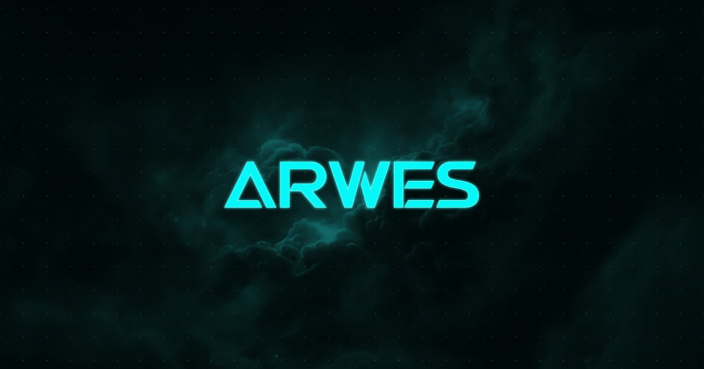

<!-- markdownlint-disable MD033 MD013 MD028 -->

# ARWES × Flare CMS

<div align="center">
  
</div>

<div align="center">
  <b>Futuristic Sci-Fi UI Framework</b> — ARWES 驱动的前端 · Flare CMS 驱动的内容 · Cloudflare 边缘部署
</div>

---

## 项目结构

```text
├── apps/
│   └── docs/          # 文档站 (Astro 7 + React islands + Tailwind)
├── packages/          # ARWES 框架核心 (Vanilla + React)
│   ├── react/         # @arwes/react — React 组件库
│   ├── animated/      # 动画引擎
│   ├── bgs/           # 动态背景
│   └── ...            # frames / text / bleeps / effects 等
├── cms/               # Flare CMS（自建 headless CMS）
│   ├── packages/core/     # CMS 引擎（D1 数据库、R2/B2 存储、Admin UI）
│   ├── packages/cms/      # Cloudflare Worker 应用
│   └── packages/astro/    # @flare-cms/astro — Astro 内容加载器
├── static/            # 公开静态资源
└── scripts/           # 工具脚本
    ├── setup-tui-opentui.mjs   # ★ 一键初始化向导 (OpenTUI)
    ├── cms.sh                  # CMS 本地开发/部署脚本
    └── www.sh                  # 站点打包脚本
```

## 快速开始

### 0. 环境要求

- **Node.js ≥ 26.4**（OpenTUI 需要原生 FFI，`~/.nvmrc` 已标注）
- npm 10+ / pnpm 10+（cms 子工作区用 pnpm）

### 1. 安装依赖

```bash
npm install --engine-strict=false
cd cms && pnpm install && pnpm build && pnpm build:astro
```

### 2. 一键初始化（TUI 向导）

```bash
npm run setup
```

向导交互式完成（**GitHub 先行**，作为 secrets 管理基础）：

1. **GitHub 登录** — WebAuth 设备流（浏览器授权，无需 token）
2. **GitHub Actions 状态** — 查看 workflow / 最近运行（可选）
3. **Cloudflare 登录** — wrangler OAuth 或 API Token，登录后**立即写入 secrets**
4. **创建资源** — D1 / R2 / KV 自动创建，**每个 ID 立即写入 secrets**
5. **Backblaze B2**（可选）— 密钥立即写入 secrets
6. **JWT_SECRET / GH_TOKEN** — 写入 secrets（GH_TOKEN 默认不上传）
7. **本地配置** — 按需写入 `.dev.vars`（gitignored）、前端 `.env`

> 所有账号凭据（Cloudflare、Backblaze B2、JWT）默认只存于 GitHub Actions secrets，
> 不进入仓库、不留在本地。

### 3. 本地开发

```bash
# 启动 CMS（Flare CMS Admin: http://localhost:8787/admin）
sh ./scripts/cms.sh dev

# 启动文档站
cd apps/docs && npm run dev   # http://localhost:9002
```

在 CMS Admin 中管理内容（Pages 集合），文档站构建时自动拉取并生成静态页面。

### 4. 部署到 Cloudflare

推送 `next` / `main` 分支触发 [GitHub Actions](./.github/workflows/deploy.yml)：

- **CMS Worker** → 构建 core/astro → D1 迁移 → `wrangler deploy`
- **文档站** → 构建（拉取 CMS 内容）→ Cloudflare Pages 部署

配置所需 secrets（向导第 3 步已自动设置）：

| Secret                                                           | 说明                          |
| ---------------------------------------------------------------- | ----------------------------- |
| `CF_API_TOKEN` / `CF_ACCOUNT_ID`                                 | Cloudflare 凭据               |
| `CF_D1_DATABASE_ID` / `CF_R2_BUCKET_NAME` / `CF_KV_NAMESPACE_ID` | Cloudflare 资源               |
| `JWT_SECRET`                                                     | CMS 认证密钥                  |
| `FLARE_API_URL` / `FLARE_API_TOKEN`                              | 部署后的 CMS 地址与只读 Token |
| `STORAGE_BACKEND` / `B2_*`                                       | （可选）Backblaze B2 存储     |

## 功能亮点

- **ARWES** — 科幻风格 UI 框架：动画、音效、帧边框、动态背景
- **Flare CMS** — 自建 headless CMS：Admin UI、内容工作流、D1 数据库、R2/B2 媒体存储
- **Astro 7** — 静态优先 + React islands + `@flare-cms/astro` 构建时内容加载
- **Backblaze B2 可选** — 用私有 B2 桶替代 R2（S3 兼容 + SigV4 签名）
- **GitHub Actions** — 每次推送自动部署到 Cloudflare Workers + Pages
- **OpenTUI 向导** — `npm run setup` 一键完成全部账号与资源初始化

## 常用命令

| 命令                          | 说明                      |
| ----------------------------- | ------------------------- |
| `npm run setup`               | OpenTUI 初始化向导        |
| `sh ./scripts/cms.sh dev`     | 本地启动 CMS              |
| `cd apps/docs && npm run dev` | 本地启动文档站            |
| `npm run build`               | 构建全部（turbo）         |
| `npm run integration`         | 构建 + 格式 + lint + 测试 |
| `npm run test`                | 单元测试（vitest）        |
| `npm run format`              | prettier 格式化           |

## License

[MIT](./LICENSE)
